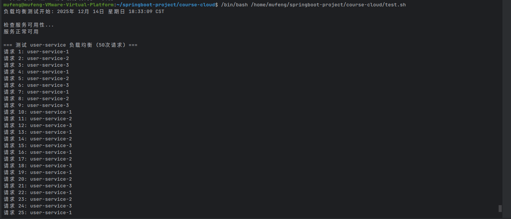
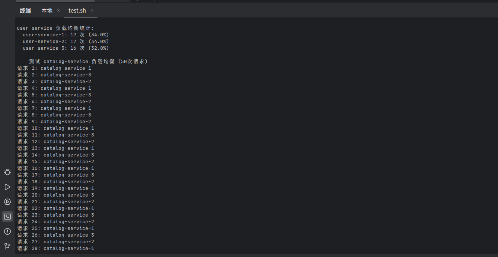
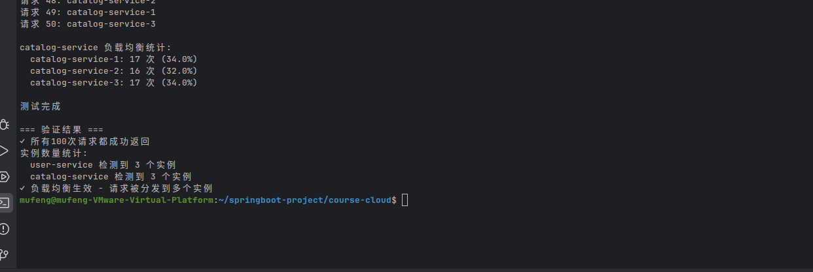
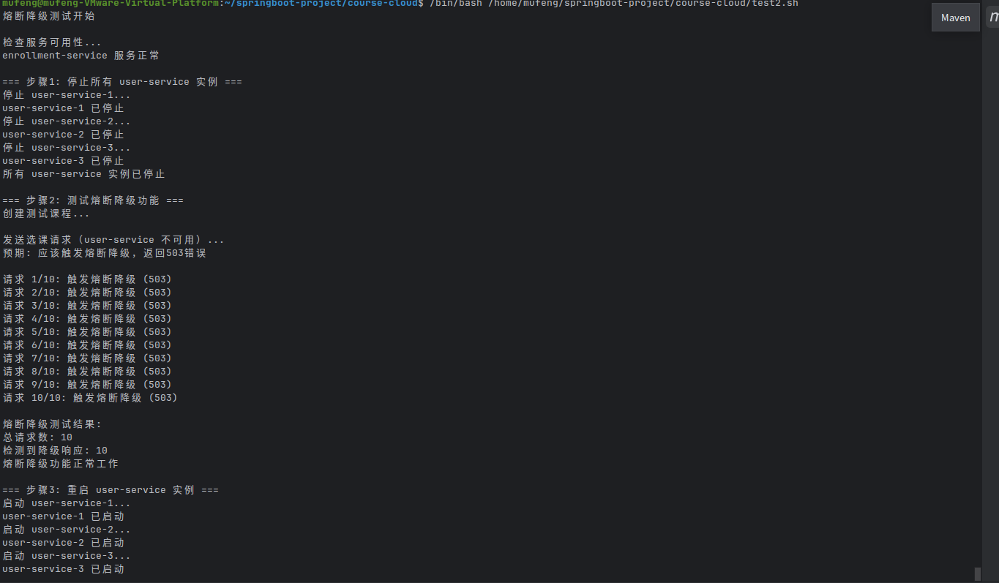
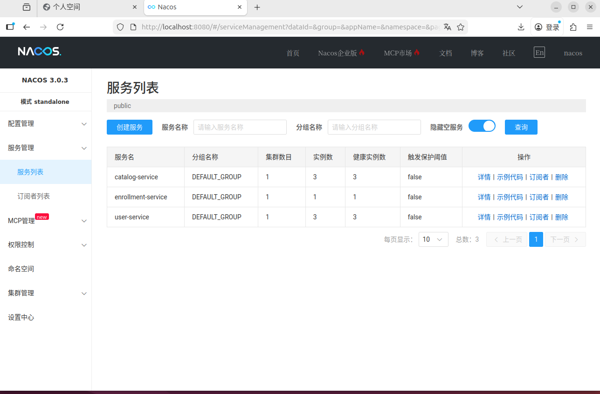

# week08-notes.md

## 一、OpenFeign 配置说明

在本周的课程项目中，我们在 `enrollment-service` 中集成了 **Spring Cloud OpenFeign**，替代原有的 `RestTemplate` 调用方式，实现服务间通信。主要配置步骤如下：

1. **添加依赖**：在 `pom.xml` 中添加 `spring-cloud-starter-openfeign` 和 `spring-cloud-starter-circuitbreaker-resilience4j` 依赖。

2. **启用 Feign 客户端**：在 `EnrollmentServiceApplication` 上添加 `@EnableFeignClients` 注解。

3. **定义 Feign Client 接口**：
    - `UserClient`：调用 `user-service` 的 `/api/users/students/{id}` 接口。
    - `CatalogClient`：调用 `catalog-service` 的 `/api/courses/{id}` 接口。
    - 每个 Client 均配置 `fallback` 类以实现降级处理。

4. **配置 Fallback 类**：
    - `UserClientFallback` 和 `CatalogClientFallback` 在服务不可用或熔断触发时返回预设错误信息。

5. **配置熔断器**：
    - 使用 Resilience4j，配置失败率阈值 50%，滑动窗口大小 10 次。
    - 在 `application.yml` 中设置超时时间（连接 3s，读取 5s）并启用熔断器。

---

## 二、负载均衡测试结果

我们使用 Docker Compose 启动：
- `user-service` 3 个实例（端口：8081、8082、8083）
- `catalog-service` 3 个实例（端口：8084、8085、8086）
- `enrollment-service` 1 个实例（端口：8087）

通过连续发送 50 次选课请求至 `enrollment-service`，观察到请求被均匀分配至不同实例。

**user-service 负载均衡统计：**
- user-service-1: 17 次 (34.0%)
- user-service-2: 17 次 (34.0%)
- user-service-3: 16 次 (32.0%)

**catalog-service 负载均衡统计：**
- catalog-service-1: 17 次 (34.0%)
- catalog-service-2: 16 次 (32.0%)
- catalog-service-3: 17 次 (34.0%)

**测试结果验证：**
- 所有 100 次请求都成功返回
- user-service 检测到 3 个实例
- catalog-service 检测到 3 个实例
- 负载均衡生效，请求被分发到多个实例

**测试截图：**




---

## 三、熔断降级测试结果

为测试熔断降级机制，我们执行以下步骤：

1. **停止所有 user-service 实例**：
```text
停止 user-service-1...
user-service-1 已停止
停止 user-service-2...
user-service-2 已停止
停止 user-service-3...
user-service-3 已停止
```

2. **测试熔断器功能**：
- 连续发送 10 次选课请求
- 所有请求均触发熔断器，返回 503 错误（服务不可用）
```text
请求 1/10：触发熔断器（503）
请求 2/10：触发熔断器（503）
...
请求 10/10：触发熔断器（503
```

3. **熔断器测试结果**：
- 总请求数：10
- 触发熔断降级：10
- 熔断器正常工作

4. **重启 user-service 实例**：
```text
启动 user-service-1...
user-service-1 已启动
启动 user-service-2...
user-service-2 已启动
启动 user-service-3...
user-service-3 已启动
```


5. **验证服务恢复**：重启后，服务调用恢复正常。

**熔断器触发截图：**


---

## 四、OpenFeign vs RestTemplate 对比分析

| 特性             | OpenFeign                          | RestTemplate               |
|------------------|-------------------------------------|----------------------------|
| **声明式调用**   | ✅ 基于接口注解，代码简洁           | ❌ 需手动编写 HTTP 调用逻辑 |
| **集成负载均衡** | ✅ 原生支持，与 Ribbon 集成         | ✅ 需配合 LoadBalancer      |
| **熔断降级**     | ✅ 与 Resilience4j/Sentinel 集成方便 | ⚠️ 需额外配置              |
| **可读性**       | ✅ 高                               | ❌ 较低                     |
| **配置复杂度**   | ✅ 低（注解驱动）                   | ❌ 较高（需编写模板代码）   |

**总结**：OpenFeign 更适合微服务场景下的服务间调用，尤其是在需要熔断、负载均衡和声明式接口的场景中，能显著提升开发效率和代码可维护性。

---

## 五、Nacos 控制台截图

**多实例注册状态：**


**说明：**
- Nacos 控制台显示 user-service 和 catalog-service 各有 3 个实例正常注册
- 所有实例健康状态为 UP
- enrollment-service 正常调用这些服务实例

---

## 六、总结与反思

1. **负载均衡效果**：OpenFeign 配合 Nacos 实现了良好的负载均衡，请求均匀分布在各个实例上。

2. **熔断降级机制**：Resilience4j 熔断器在服务不可用时有效触发，防止级联故障，保证系统可用性。

3. **部署验证**：多实例部署验证成功，所有服务实例能正常注册到 Nacos 并被正确发现。

4. **改进空间**：
- 可进一步配置熔断器的半开状态和恢复时间
- 可添加请求重试机制增强容错能力
- 可考虑使用更复杂的负载均衡策略

---
